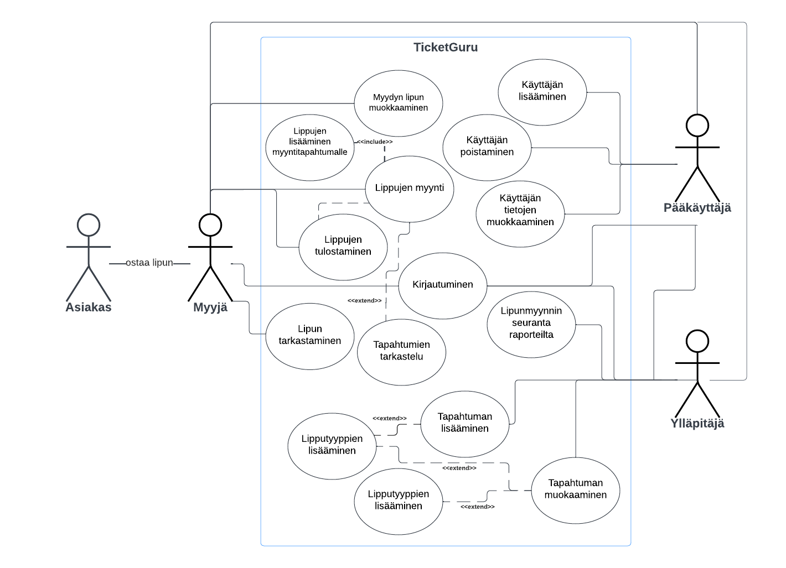

# TicketGuru

Tiimi: De Lorme Heli, Haiko Milja, Koivisto Janina, Pulli Topi, Sirviö Jukka-Pekka
> Kirjoittamisen avuksi, poistetaan tämä lopullisesta versiosta:
> https://github.com/adam-p/markdown-here/wiki/Markdown-Cheatsheet

## Johdanto

Projektin aiheena on myyntipisteessä käytettävä lipunmyyntijärjestelmä. Asiakas on antanut sovellukselle nimen TicketGuru.

Asiakkaana on lipputoimisto, joka määrittelee tapahtumat, joihin lippuja myydään. Sovelluksella hallinnoidaan ja seurataan lipunmyyntiä.  Sovellus on tarkoitettu lipunmyyjien ja toimiston omaan käyttöön. Asiakas ei pysty itse ostamaan lippua suoraan järjestelmästä.  Tapahtumia voi lisätä ja muokata sekä nille voi luoda erilaisia lipputyyppejä.

Lippuja pitää voida myydä ja tulostaa sekä lippujen on sisällettävä helposti tarkastettava yksilöivä koodi, jotta lippu voidaan merkitä käytetyksi. Ennakkomyynnin jälkeen jäljellä olevat liput tulee pystyä tulostamaan, jotta ne voidaan myydä ovella. 

Myytyjen lippujen määrää voidaan seurata raporteilta tapahtumakohtaisesti.

Järjestelmä toteutetaan palvelinpuolen osalta Javalla, Spring Boot -viitekehyksellä. Käyttöliittymä rakennetaan Reactilla. Tavoitteena on, että käyttöliittymä olisi käyettävissä kaikilla tavanomaisilla päätelaitteilla (puhelin, taulutietokone, tietokone).

## Järjestelmän määrittely

TicketGuru-sovelluksen määrittely on kuvattu alla käyttäjäryhminä, käyttötapauskaavioin ja käyttötapauksin. Määrittelyjä on tehty myös käyttäjätarinoina, jotka löytyvät Githubin Projectista. linkki? 

### Käyttäjäryhmät ja -roolit

*Myyjä* = henkilö, joka toimii asiakasrajapinnassa, syöttää ostoja/tilauksia sovellukseen. Pystyy myös tarkistamaan lipun.

*Ylläpitäjä* = henkilö, joka syöttää tapahtumatietoja sovellukseen.

*Asiakas* = henkilö, joka ostaa lipun. Ei ole sovelluksen käyttäjä., koska myyntitapahtumassa asiakkalla ei ole pääsyä sovellukseen.

*Pääkäyttäjä* = Sovelluksen pääkäyttäjä, joka voi lisätä, muokata ja poistaa käyttäjäoikeuksia.

*Tilaaja* = Lipputoimisto, joka on tilannut järjestelmän

### Käyttötapauskaavio

[Lucidchart: Käyttötapauskaavio](https://lucid.app/lucidchart/71f2e8a8-ce9b-40b4-b3ee-a7a8fe56947b/edit?viewport_loc=-23%2C54%2C2072%2C1035%2C0_0&invitationId=inv_9bd0a9fd-a896-43e9-8b23-7e40b79d7f51)

### Käyttäjätarinat

Käyttäjätarinat löytyvät projektista.

https://github.com/users/miljahai/projects/1/views/1

## Käyttöliittymä

Käyttöliittymäkaaviossa on kuvattuna käyttäjätyypin tarkistus kirjautumisen yhteydessä. Pää/aloitussivun näkymä riippuu käyttäjän oikeuksista muokata tietoja ja tapahtumia. 
Myyjällä ei pääsyä muiden tietoihin tai myyntiraportteihin. Vain pääkäyttäjä pääsee muokkaamaan tai lsiäämään käyttäjätietoja.

Lippujen myyntitilanteessa avoimet kohteet listataan selattavaksi ja saatavuus tarkistetaan uudelleen ennen vahvistusta. 

## Tietokanta

### Tietokantamalli

### EventRecord
EventRecord-taulu sisältää Tapahtumat, joille lippuja myydään. EventRecordista on OneToMany-viittaus Ticket-tauluun ja ManyToMany-viittaus TicketTypes-tauluun. Taulu on nimetty muotoon EventRecord, koska Event on varattu sana Javassa.

Kenttä | Tyyppi | Kuvaus
------ | ------ | ------
eventrecord_id | int PK | Tapahtuman id
eventrecord_name | varchar(100) |  Tapahtuman nimi
eventrecord_date | date | Tapahtuman päivämäärä
eventrecord_startdate | LocalTime | Tapahtuman aloitusaika
eventrecord_enddate | LocalTime | Tapahtuman päättymisaika
deleted | boolean | Poistomerkintä. Oletuksena false. Jos tapahtuma poistetaan, muutetaan trueksi.

### EventRecordTicketTypes

EventRecord- ja TicketType-taulun välinen aputaulu ManyToMany-riippuvuudelle.

Kenttä | Tyyppi | Kuvaus
------ | ------ | ------
eventrecord_id | int PK | EventRecordin eli Tapahtuman id
ticket_type_id | int PK | TicketTypen eli Lipputyypin id

### Ticket
Ticket-taulu sisältää myytävät liput. Sisältää ManyToOne- viittaukset TicketType- ja EventRecord-tauluihin.

Kenttä | Tyyppi | Kuvaus
----- | ----- | -----
ticket_id | int PK | Lipun id
ticket_code | varchar(50) | Tarkistuskoodi
price | double | Lipun hinta
deleted | boolean | Poistomerkintä. Oletuksena false. Jos tapahtuma poistetaan, muutetaan trueksi.

### TicketType
TicketType-taulu sisältää lipputyypit. Sisältää OneToMany-viittauksen Ticket-tauluun ja ManyToMany-viittauksen EventRecord-tauluun.

Kenttä | Tyyppi | Kuvaus
----- | ----- | -----
ticket_type_id | int PK | Lipputyypin id
name | varchar(50) | Lipputyypin nimi
price | double | Lipputyypin hinta
deleted | boolean | Poistomerkintä. Oletuksena false. Jos tapahtuma poistetaan, muutetaan trueksi.

### SalesEvent
SalesEvent-taulu sisältää ostotapahtuman tiedot. SalesEventistä on OneToMany-viittaus SalesEventTickets-tauluun ja User-tauluun.

Kenttä | Tyyppi | Kuvaus
------ | ------ | ------
salesevent_id | int PK | Ostotapahtuman id
sale_date | date |  Ostotapahtuman päivämäärä
sale_time | LocalTime | Ostotapahtuman tarkka aika
price | double | Ostotapahtuman kokonaissumma
user_id | int FK | Ostotapahtuman ostajan käyttäjä id
deleted | boolean | Poistomerkintä. Oletuksena false. Jos tapahtuma poistetaan, muutetaan trueksi.

### User
Sisältää ManyToOne-viittauksen Role-tauluun

Kenttä | Tyyppi | Kuvaus
------ | ------ | ------
user_id | int PK | Käyttäjän id
first_name | varchar(150) | Käyttäjän etunimi
last_name | varchar(150) | Käyttäjän sukunimi
email | varchar(50) | Käyttäjän sähköposti
password | varchar(50) | Käyttäjän salasana
deleted | boolean | Poistomerkintä. Oletuksena false. Jos tapahtuma poistetaan, muutetaan trueksi.

### Role
Role-taulusta OneToMany-viittaus User-tauluun

Kenttä | Tyyppi | Kuvaus
------ | ------ | ------
role_id | int PK | Roolin id
role_name | varchar (100) | Roolin nimi

> ## Tekninen kuvaus
> 
> Teknisessä kuvauksessa esitetään järjestelmän toteutuksen suunnittelussa tehdyt tekniset
> ratkaisut, esim.
> 
> -   Missä mikäkin järjestelmän komponentti ajetaan (tietokone, palvelinohjelma)
>     ja komponenttien väliset yhteydet (vaikkapa tähän tyyliin:
>     https://security.ufl.edu/it-workers/risk-assessment/creating-an-information-systemdata-flow-diagram/)
> -   Palvelintoteutuksen yleiskuvaus: teknologiat, deployment-ratkaisut yms.
> -   Keskeisten rajapintojen kuvaukset, esimerkit REST-rajapinta. Tarvittaessa voidaan rajapinnan käyttöä täsmentää
>     UML-sekvenssikaavioilla.
> -   Toteutuksen yleisiä ratkaisuja, esim. turvallisuus.
> 
> Tämän lisäksi
> 
> -   ohjelmakoodin tulee olla kommentoitua
> -   luokkien, metodien ja muuttujien tulee olla kuvaavasti nimettyjä ja noudattaa
>     johdonmukaisia nimeämiskäytäntöjä
> -   ohjelmiston pitää olla organisoitu komponentteihin niin, että turhalta toistolta
>     vältytään
> 
> ## Testaus
> 
> Tässä kohdin selvitetään, miten ohjelmiston oikea toiminta varmistetaan
> testaamalla projektin aikana: millaisia testauksia tehdään ja missä vaiheessa.
> Testauksen tarkemmat sisällöt ja testisuoritusten tulosten raportit kirjataan
> erillisiin dokumentteihin.
> 
> Tänne kirjataan myös lopuksi järjestelmän tunnetut ongelmat, joita ei ole korjattu.
> 
> ## Asennustiedot
> 
> Järjestelmän asennus on syytä dokumentoida kahdesta näkökulmasta:
> 
> -   järjestelmän kehitysympäristö: miten järjestelmän kehitysympäristön saisi
>     rakennettua johonkin toiseen koneeseen
> 
> -   järjestelmän asentaminen tuotantoympäristöön: miten järjestelmän saisi
>     asennettua johonkin uuteen ympäristöön.
> 
> Asennusohjeesta tulisi ainakin käydä ilmi, miten käytettävä tietokanta ja
> käyttäjät tulee ohjelmistoa asentaessa määritellä (käytettävä tietokanta,
> käyttäjätunnus, salasana, tietokannan luonti yms.).
> 
> ## Käynnistys- ja käyttöohje
> 
> Tyypillisesti tässä riittää kertoa ohjelman käynnistykseen tarvittava URL sekä
> mahdolliset kirjautumiseen tarvittavat tunnukset. Jos järjestelmän
> käynnistämiseen tai käyttöön liittyy joitain muita toimenpiteitä tai toimintajärjestykseen liittyviä asioita, nekin kerrotaan tässä yhteydessä.
> 
> Usko tai älä, tulet tarvitsemaan tätä itsekin, kun tauon jälkeen palaat
> järjestelmän pariin !
