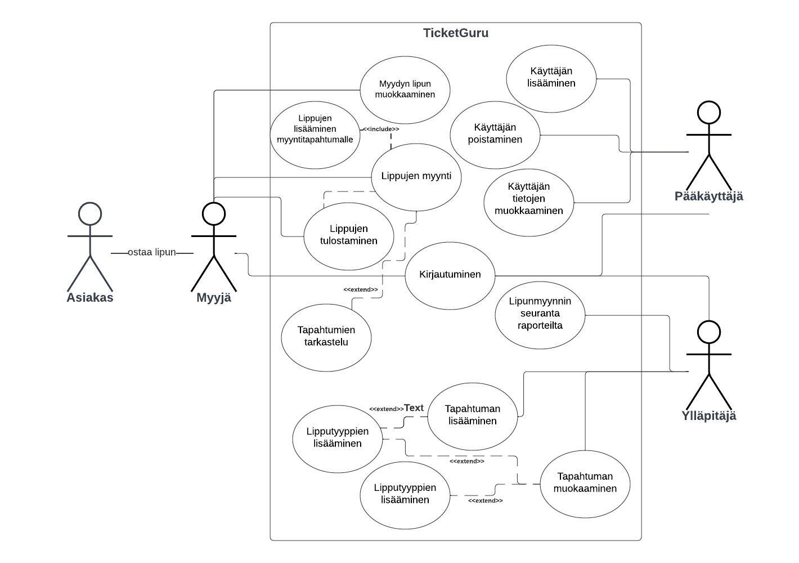

# TicketGuru

Tiimi: De Lorme Heli, Haiko Milja, Koivisto Janina, Pulli Topi, Sirviö Jukka-Pekka
> Kirjoittamisen avuksi, poistetaan tämä lopullisesta versiosta:
> https://github.com/adam-p/markdown-here/wiki/Markdown-Cheatsheet

## Johdanto

Projektin aiheena on myyntipisteessä käytettävä lipunmyyntijärjestelmä. Asiakas on antanut sovellukselle nimen TicketGuru.

Asiakkaana on lipputoimisto, joka määrittelee tapahtumat, joihin lippuja myydään. Sovelluksella hallinnoidaan ja seurataan lipunmyyntiä.  Sovellus on tarkoitettu lipunmyyjien ja toimiston omaan käyttöön. Asiakas ei pysty itse ostamaan lippua suoraan järjestelmästä.  Tapahtumia voi lisätä ja muokata sekä nille voi luoda erilaisia lipputyyppejä.

Lippuja pitää voida myydä ja tulostaa sekä lippujen on sisällettävä helposti tarkastettava yksilöivä koodi, jotta lippu voidaan merkitä käytetyksi. Ennakkomyynnin jälkeen jäljellä olevat liput tulee pystyä tulostamaan, jotta ne voidaan myydä ovella. 

Myytyjen lippujen määrää voidaan seurata raporteilta tapahtumakohtaisesti.

Järjestelmä toteutetaan palvelinpuolen osalta Javalla, Spring Boot -viitekehyksellä. Käyttöliittymä rakennetaan Reactilla. Tavoitteena on, että käyttöliittymä olisi käyettävissä kaikilla tavanomaisilla päätelaitteilla (puhelin, taulutietokone, tietokone).

## Järjestelmän määrittely

TicketGuru-sovelluksen määrittely on kuvattu alla käyttäjäryhminä, käyttötapauskaavioin ja käyttötapauksin. Määrittelyjä on tehty myös käyttäjätarinoina, jotka löytyvät Githubin Projectista. linkki? 

### Käyttäjäryhmät ja -roolit

*Myyjä* = henkilö, joka toimii asiakasrajapinnassa, syöttää ostoja/tilauksia sovellukseen.

*Ylläpitäjä* == henkilö, joka syöttää tapahtumatietoja sovellukseen.

*Asiakas* = henkilö, joka ostaa lipun. Ei ole sovelluksen käyttäjä., koska myyntitapahtumassa asiakkalla ei ole pääsyä sovellukseen.

*Pääkäyttäjä* = Sovelluksen pääkäyttäjä, joka voi lisätä, muokata ja poistaa käyttäjäoikeuksia.

*Tilaaja* = Lipputoimisto, joka on tilannut järjestelmän

### Käyttötapauskaavio

[Lucidchart: Käyttötapauskaavio](https://lucid.app/lucidchart/71f2e8a8-ce9b-40b4-b3ee-a7a8fe56947b/edit?viewport_loc=-23%2C54%2C2072%2C1035%2C0_0&invitationId=inv_9bd0a9fd-a896-43e9-8b23-7e40b79d7f51)

### Käyttäjätarinat

Käyttäjätarinat löytyvät projektista.

https://github.com/users/miljahai/projects/1/views/1

## Käyttöliittymä

Kuva!!!

> Esitetään käyttöliittymän tärkeimmät (vain ne!) näkymät sekä niiden väliset siirtymät käyttöliittymäkaaviona. 
> 
> Jos näkymän tarkoitus ei ole itsestään selvä, se pitää kuvata lyhyesti.

## Tietokanta

Järjestelmään säilöttävä ja siinä käsiteltävät tiedot ja niiden väliset suhteet
kuvataan käsitekaaviolla. Käsitemalliin sisältyy myös taulujen välisten viiteyhteyksien ja avainten
määritykset. Tietokanta kuvataan käyttäen jotain kuvausmenetelmää, joko ER-kaaviota ja UML-luokkakaaviota.

Lisäksi kukin järjestelmän tietoelementti ja sen attribuutit kuvataan
tietohakemistossa. Tietohakemisto tarkoittaa yksinkertaisesti vain jokaisen elementin (taulun) ja niiden
attribuuttien (kentät/sarakkeet) listausta ja lyhyttä kuvausta esim. tähän tyyliin:

> ### _Tilit_
> _Tilit-taulu sisältää käyttäjätilit. Käyttäjällä voi olla monta tiliä. Tili kuuluu aina vain yhdelle käyttäjälle._
>
> Kenttä | Tyyppi | Kuvaus
> ------ | ------ | ------
> id | int PK | Tilin id
> nimimerkki | varchar(30) |  Tilin nimimerkki
> avatar | int FK | Tilin avatar, viittaus [avatar](#Avatar)-tauluun
> kayttaja | int FK | Viittaus käyttäjään [käyttäjä](#Kayttaja)-taulussa

## Tekninen kuvaus

Teknisessä kuvauksessa esitetään järjestelmän toteutuksen suunnittelussa tehdyt tekniset
ratkaisut, esim.

-   Missä mikäkin järjestelmän komponentti ajetaan (tietokone, palvelinohjelma)
    ja komponenttien väliset yhteydet (vaikkapa tähän tyyliin:
    https://security.ufl.edu/it-workers/risk-assessment/creating-an-information-systemdata-flow-diagram/)
-   Palvelintoteutuksen yleiskuvaus: teknologiat, deployment-ratkaisut yms.
-   Keskeisten rajapintojen kuvaukset, esimerkit REST-rajapinta. Tarvittaessa voidaan rajapinnan käyttöä täsmentää
    UML-sekvenssikaavioilla.
-   Toteutuksen yleisiä ratkaisuja, esim. turvallisuus.

Tämän lisäksi

-   ohjelmakoodin tulee olla kommentoitua
-   luokkien, metodien ja muuttujien tulee olla kuvaavasti nimettyjä ja noudattaa
    johdonmukaisia nimeämiskäytäntöjä
-   ohjelmiston pitää olla organisoitu komponentteihin niin, että turhalta toistolta
    vältytään

## Testaus

Tässä kohdin selvitetään, miten ohjelmiston oikea toiminta varmistetaan
testaamalla projektin aikana: millaisia testauksia tehdään ja missä vaiheessa.
Testauksen tarkemmat sisällöt ja testisuoritusten tulosten raportit kirjataan
erillisiin dokumentteihin.

Tänne kirjataan myös lopuksi järjestelmän tunnetut ongelmat, joita ei ole korjattu.

## Asennustiedot

Järjestelmän asennus on syytä dokumentoida kahdesta näkökulmasta:

-   järjestelmän kehitysympäristö: miten järjestelmän kehitysympäristön saisi
    rakennettua johonkin toiseen koneeseen

-   järjestelmän asentaminen tuotantoympäristöön: miten järjestelmän saisi
    asennettua johonkin uuteen ympäristöön.

Asennusohjeesta tulisi ainakin käydä ilmi, miten käytettävä tietokanta ja
käyttäjät tulee ohjelmistoa asentaessa määritellä (käytettävä tietokanta,
käyttäjätunnus, salasana, tietokannan luonti yms.).

## Käynnistys- ja käyttöohje

Tyypillisesti tässä riittää kertoa ohjelman käynnistykseen tarvittava URL sekä
mahdolliset kirjautumiseen tarvittavat tunnukset. Jos järjestelmän
käynnistämiseen tai käyttöön liittyy joitain muita toimenpiteitä tai toimintajärjestykseen liittyviä asioita, nekin kerrotaan tässä yhteydessä.

Usko tai älä, tulet tarvitsemaan tätä itsekin, kun tauon jälkeen palaat
järjestelmän pariin !
